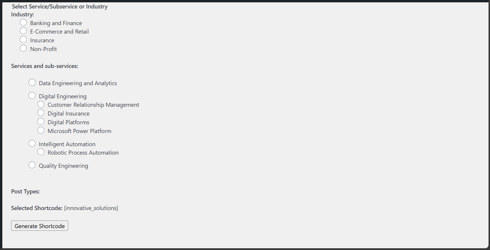
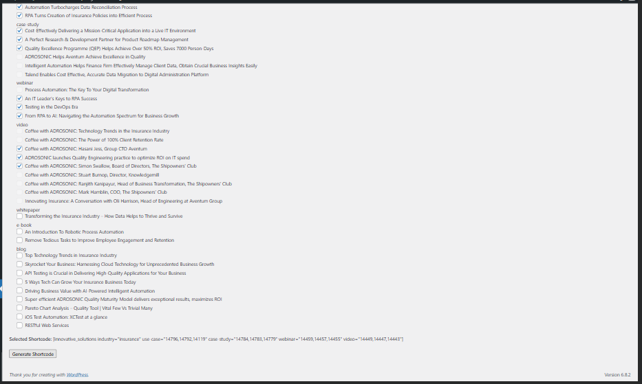
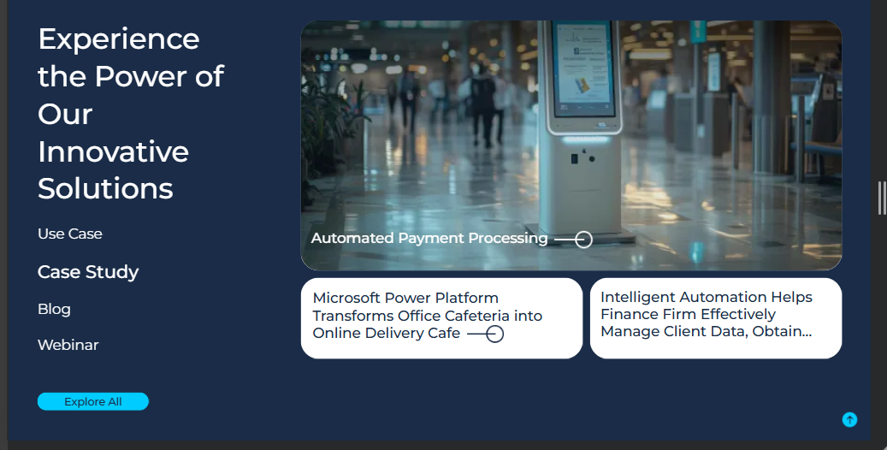
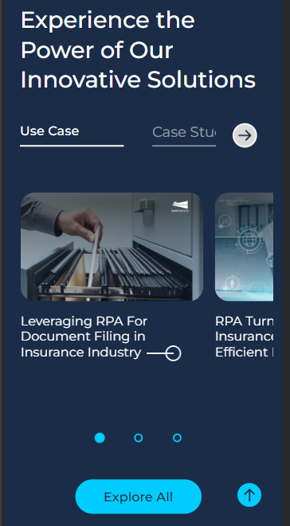

# Innovative Solutions Insights Plugin

A custom WordPress plugin to display insight posts (Use Cases, Case Studies, Webinars, and Blogs) with categorization and responsive layout.  
It allows administrators to select posts from each category via shortcode settings and display them in a grid or mobile carousel.

---

## Description

This plugin displays selected posts of different types (Use Case, Case Study, Webinar, and Blog) on **Service**, **Sub-Service**, and **Industry** pages.  

- Displays each post type in a **2-row grid layout**.  
- The **first column occupies full width** and allows adding a **video via meta box** for the first post of each type.  
- Supports **4 post types** that can be showcased simultaneously.  
- On **mobile devices**, the layout converts into a **carousel**.  
- Provides a **settings page** to generate filtered shortcode based on:
  - Industry  
  - Service  
  - Sub-Service  
- Under each filter, the admin can **select 3 posts of each type**.  
- ⚠️ *Users should ensure only 3 posts are added per type.*  

---

## Installation

1. Download or clone this repository into your WordPress `wp-content/plugins/` directory.  
2. Activate the plugin from the WordPress **Plugins** menu.  
3. Navigate to the plugin settings page to configure filters and generate shortcode.  

---

## Usage

Insert the generated shortcode in any page, post, or template where you want the insights to appear.  

---

### ScreenShots






---


### Example Shortcode

```php
[innovative_solutions service_name="intelligent-automation" use-case="14796,14119,14792" case-study="14781,14780,14123" webinar="14461,14459,14455" blog="14244,14240,14233"]
